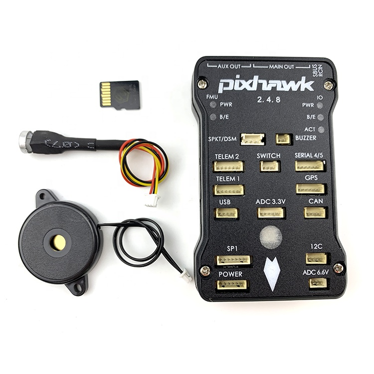

# Simulink PX4 - Pixhawk 2.4.8


Esta placa es **PX4 Pixhawk 1 - px4_fmu-v3_default**.

**Asumo que se tiene parte de conocimiento sobre el uso del paquete PX4 para Matlab y Simulink.**
**Este repo añade información adicional que considero útil.**

Primero, instalar el paquete de soporte para [UAV Toolbox Support Package for PX4 Autopilots](https://es.mathworks.com/help/supportpkg/px4/index.html). El tipo de control que vamos a aplicar es **Design Flight Controller Algorithm in Simulink**, esta opción se seleciona en algún punto de la configuración de la placa. [Setup and Configuration](https://es.mathworks.com/help/supportpkg/px4/setup-and-configuration.html)

Para usar la placa debemos tener en consideración que por defecto, para armar la salida de los PWM tenemos que tener el Safety Switch instalado en la placa. Y pulsarlo durante 3 segundos para armar las salidas, cada vez que se resetea la placa. 

**Para evitar este paso cada vez que lanzamos un nuevo programa en la placa tengamos que armar la placa**, en algún momento hemos grabado un archivo en la SD en formato FAT32, llamado **rc.txt** en la carpeta **etc**.

En el archivo nos encontraremos el **rc.txt**.
```
...
fmu mode_pwm            # This is required for AUX PWM channels
usleep 1000
px4_simulink_app start  
...
```

Y modificando el archivo añadiendo lo siguiente. Con este comando eliminamos la seguridad de armado, **precaución: esto puedo provocar que si dejamos un programa cargado en 'Build, Deploy & Start' que encienda los motores nos pueda dar un susto o incluso provocar un accidente**

```
...
fmu mode_pwm            # This is required for AUX PWM channels
usleep 1000
px4io safety_off
usleep 1000
px4_simulink_app start  
...
```

## Ejemplos

- px4_plant.slx - implementa un control sencillo PID para la orientación
- px4demo_PWM.slx - implementa un simulink sencillo para enviar acciones de control y recibir mensajes de la pixhawk